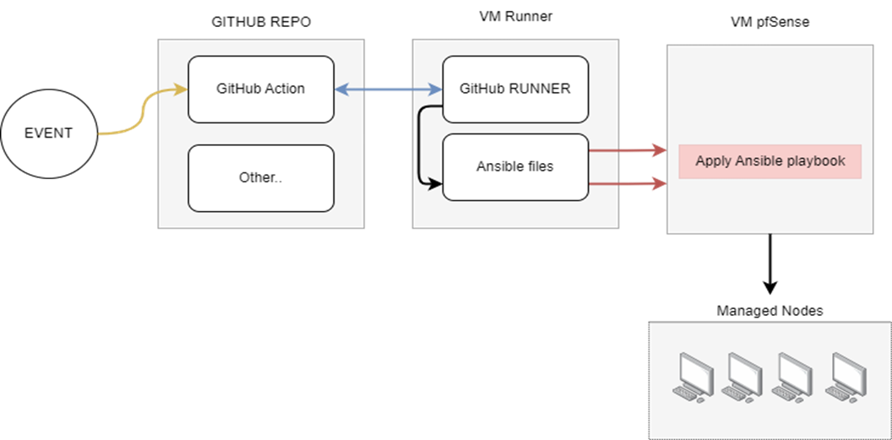

# USEFUL DOCUMENTATION
* GitHub Action ==> https://docs.github.com/en/actions
* GitHub Self-Hosted Runner ==> https://docs.github.com/en/actions/hosting-your-own-runners/managing-self-hosted-runners/adding-self-hosted-runners
* Ansible ==> https://docs.ansible.com/ansible/latest/getting_started/index.html
* pfSensible ==> https://galaxy.ansible.com/pfsensible/core

