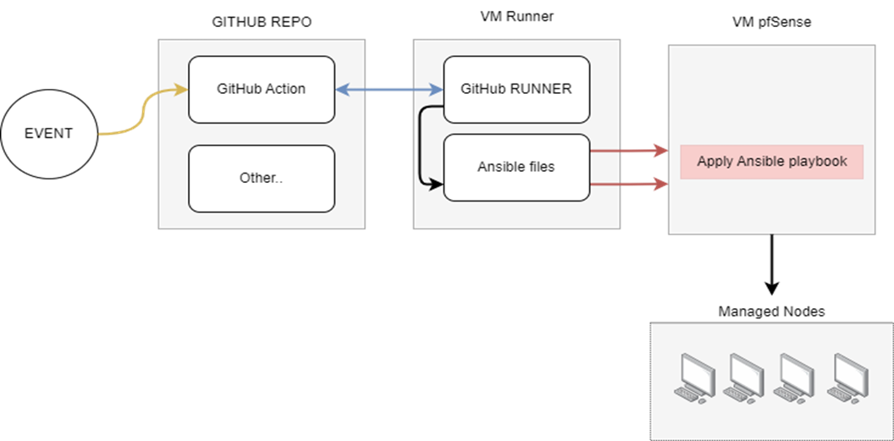

# USEFUL DOCUMENTATION
* GitHub Action&nbsp;&nbsp;&nbsp;&nbsp;==> https://docs.github.com/en/actions
* GitHub Self-Hosted Runner&nbsp;&nbsp;&nbsp;&nbsp;==> https://docs.github.com/en/actions/hosting-your-own-runners/managing-self-hosted-runners/adding-self-hosted-runners
* GitHub pre-build runner&nbsp;&nbsp;&nbsp;&nbsp;==>https://github.com/actions/runner
* Ansible&nbsp;&nbsp;&nbsp;&nbsp;==> https://docs.ansible.com/ansible/latest/getting_started/index.html
* pfsense&nbsp;&nbsp;&nbsp;&nbsp;==> https://docs.netgate.com/pfsense/en/latest/
* pfSensible&nbsp;&nbsp;&nbsp;&nbsp;==> https://galaxy.ansible.com/pfsensible/core

# LDAP SERVER
Configure Active Directory just before
* microsoft server ==> https://www.miniorange.com/guide-to-setup-ldaps-on-windows-server
* LDAPS ==> https://techcommunity.microsoft.com/t5/sql-server-blog/step-by-step-guide-to-setup-ldaps-on-windows-server/ba-p/385362
* LDAP basics ==> https://www.redhat.com/en/topics/security/what-is-ldap-authentication

## MODULES USED FOR LDAP SERVER TEST AND USER CONFIGURATION
* https://github.com/pfsensible/core/wiki/pfsense_authserver_ldap
* https://github.com/pfsensible/core/wiki/pfsense_ca
* https://github.com/pfsensible/core/wiki/pfsense_group#pfsensiblecorepfsense_group

